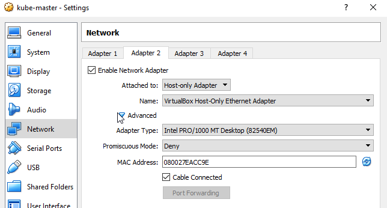
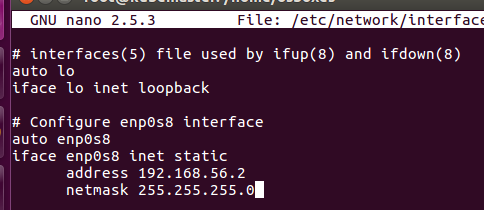

## UDEMY course Kubernetes, important notes

https://www.udemy.com/learn-kubernetes/learn

#### Section 3 - Setup VirtualBox

- Setup VirtualBox : https://www.virtualbox.org/

- Download OS Image : https://www.osboxes.org/  
    - Select VirtualBox Image (Ubuntu)  
    - Extract to disk

- Create a new VM  
    - Use existing disk (Extracted file)  
    - 2Gig Ram

- Change Network Adapter  
    - Settings -> Network Adapter -> Bridged  
    - Take a Snapshot
    
- SSH application : https://mobaxterm.mobatek.net/  
    - start the VM
    - User/Password: osboxes / osboxes.org
    - open terminal
    - ifconfig to get the IP
    - SSH into the machine
        - if connection refused, check in terminal
            ```
            service ssh status
            sudo su
            apt-get update
            apt-get install openssh-server
            service ssh status
            ```
            
#### Section 4 - Install Docker

- SSH in machine
    ```
    apt-get install -y docker.io
    ```

#### Section 5 reference

[See YAML examples in yaml-udemy](./k8s-udemy/deployment-definition.yml)

#####@Important
After restart, to fix error:
- The connection to the server localhost:8080 was refused - did you specify the right host or port?
- error: the server doesn't have a resource type "cronjobs"
```
sudo cp /etc/kubernetes/admin.conf $HOME/ 
sudo chown $(id -u):$(id -g) $HOME/admin.conf 
export KUBECONFIG=$HOME/admin.conf
```

Kubernetes Documentation Site: https://kubernetes.io/docs/

Kubernetes Documentation Concepts: https://kubernetes.io/docs/concepts/

Kubernetes Documentation Setup: https://kubernetes.io/docs/setup/pick-right-solution/

Kubernetes Documentation - Minikube Setup: https://kubernetes.io/docs/getting-started-guides/minikube/

#### Section 6 kubeadm


Install kubeadm: https://kubernetes.io/docs/setup/independent/install-kubeadm/

- create 3 VM in VirtualBox (kube-master, kube-node1, kube-node2)
    - Do section 3 then shutdown
    - 2Gig, 2CPU, Network bridged
    - Clone X2 : reinitialize mac adress, linked clone
    - Set host unique names  
    ```
    sudo su
    nano /etc/hostname
    nano /etc/hosts
    shutdown now
    ```
    - Assign static IP adresses : Global tools -> Host Network Manager
    https://www.tecmint.com/ip-command-examples/
        - Optionally create a new Host network
        - uncheck DHCP server
        - Each Machine -> Settings -> Network -> Adapter 2
        
        - ```ip addr show``` : take the new interface without IP
        - ```ip addr add IP dev INTERFACE``` (ip addr add 192.168.56.5 dev enp0s8)
        - ```ip addr del OLD_IP dev INTERFACE```
        - ```nano /etc/network/interfaces```
        
        - ```reboot```
    - Disable swap
        - ```swapoff -a```
        - ```nano /etc/fstab``` comment swap line

#### Section 13 reference
Oracle VirtualBox:  https://www.virtualbox.org/

Link to download VM images: http://osboxes.org/

Link to kubeadm installation instructions: https://kubernetes.io/docs/setup/independent/install-kubeadm/

Note: If you run into network issues try using Flannel networking instead of Calico.

#### Section 15 (part 2, 3, 4 in steps image)
- install docker
```
apt-get update
apt-get install -y docker.io
```
- prepare environment @Important: install curl, kubelet, kubeadm, kubectl
```
apt-get update && apt-get install -y apt-transport-https curl
apt install curl
curl -s https://packages.cloud.google.com/apt/doc/apt-key.gpg | apt-key add -
****COPY FROM HERE
cat <<EOF >/etc/apt/sources.list.d/kubernetes.list
deb http://apt.kubernetes.io/ kubernetes-xenial main
EOF****TO HERE
apt-get update
apt-get install -y kubelet kubeadm kubectl
```
- init master and cluster
In documentation:  
(2/4) You need to choose a Pod Network Plugin in the next step.  
Depending on what third-party provider you choose, you might have to set the ```--pod-network-cidr``` to something provider-specific.  
The tabs below will contain a notice about what flags on ```kubeadm init``` are required  
(3/4) With Flannel: 

    ```kubeadm init --pod-network-cidr=10.244.0.0/16 --apiserver-advertise-address=192.168.56.5```
    
    Copy the join command from kubeadm init

    ```export KUBECONFIG=/etc/kubernetes/admin.conf```

- Install Calico or Flannel pod Network (Flannel did not work on mine)
    ```
    sysctl net.bridge.bridge-nf-call-iptables=1
    Flannel:
    kubectl apply -f https://raw.githubusercontent.com/coreos/flannel/v0.9.1/Documentation/kube-flannel.yml
    Calico:
    kubectl apply -f https://docs.projectcalico.org/v3.1/getting-started/kubernetes/installation/hosted/kubeadm/1.7/calico.yaml
    ```
    Verify
    ```
    kubectl get pods --all-namespaces
    ```
    
- Join nodes with command
```
kubeadm join 192.168.56.5:6443 --token xqryaj.gbf630g8buzwkzj8 --discovery-token-ca-cert-hash sha256:fec392a8f842781c929c201109f5f98a982fc2393dacb0466f2e70c665e05b50
```

#### Section 17 google cloud
If you haven't created an account already, you can get FREE 12 Months subscription to Google Cloud Platform. Check it out here:

https://cloud.google.com/free/

Kubernetes on Google Cloud: https://cloud.google.com/kubernetes-engine/docs/

#### Section 18
https://labs.play-with-k8s.com/

#### Section 20 Pods

Creation see: yaml/readme-yaml-udemy.md

Commands:
```
kubectl run nginx --image=nginx
kubectl describe pods
kubectl get pods -o wide
```

Pod Overview: https://kubernetes.io/docs/concepts/workloads/pods/pod-overview/

#### Section 28 Controllers

- Replication controller have been replaced by Replica Sets
- Replication controller, responsible of spawning pods and keeping minimum alive. (Creates multiples instance of a Pod)


See: yaml/rc-definition.yml


#### ReplicaSet 
See: yaml/replicaset-definition.yml

- Scale:
   Modify replicaset-definition.yml with this and use replace
    ```
    replicas: 6
    ```
- Commands
    ```
    kubectl create -f replicaset-definition.yml
    kubectl get replicaset
    kubectl replace -f replicaset-definition.yml
    kubectl scale --replicas=6 -f replicaset-definition.yml
    kubectl scale --replicas=6 replicaset myapp-replicaset #type and name
    kubectl delete myapp-replicaset #Also delete Pods
    ```
    
**Note: If you create a pod with same name manually, replicaset will delete it to keep the scale number correctly.**

### Section 30 deployments

Deployment is responsible of updating instances with rolling update, rollback, pause, resume.

Automatically creates a replicaset 


- Commands
    ```
    kubectl create -f deployment-definition.yml [--record]
    kubectl get deployments
    kubectl get all
    kubectl delete deployment myapp-deployment
    ```

### Section 32 update/rollback

- Commands
    ```
    kubectl rollout status deployment/myapp-deployment
    kubectl rollout history deployment/myapp-deployment
    kubectl apply -f deployment-definition.yml #Will start a rollout
    kubectl set image deployment/myapp-deployment nginx-container=nginx:1.9.1
    kubectl rollout undo deployment/myapp-deployment #Rollback
    ```
    
### Section 34 Networking

- IP address is assigned to a pod under the internal network. (10.244.0.0) 
    Those IP are in the range of 10.244.x.x


- Rules:
  - All containers/PODs can communicate to one another without NAT
  - All nodes can communicate with all containers and vice-versa without NAT

### Section 36 Services - NodePort

##### Types:
- NodePort: A service listen to a port on the Node and forwards the request to a port on the Pod
- ClusterIP: Creates a virtual IP inside the cluster to enable communication between different services  
  I.e.: A set of front end servers with a set of backend servers.
- LoadBalancer: Provisions a load balancer for the application


- To link the service to the pod, use selector with pod labels
```
  selector:
    app: myapp
    type: front-end
```

- With multiple Pods


- Commands

```
kubectl create -f service-definition.yml
kubectl get services
```

### Section 38 Services - ClusterIP


### Section 40 Microservices

Google Cloud Engine: https://cloud.google.com/kubernetes-engine/docs/quickstart

- Menu -> Kubernetes Cluster -> Create Cluster -> enter names -> Create

    

- Click connect on cluster


# Linguee:

- Node : Machine (Physical or Virtual)
- Pod : Single applicartion instance. Smallest object you can create.
    * Pod have 1-1 relationship with container (app)
    * Pod can have multiple containers but different kind
    * Containers in same Pod share localhost address.
    