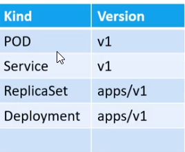

## Basic structure

#### versions


#### mendatory 4 properties

```
apiVersion: v1
kind: Pod
metadata: #Structure is predefined
  name: myapp-pod
  labels:   #Can put anything under labels
    app: myapp
    type: front-end
    
spec:
  containers:     #Can be List/Array
    - name: nginx-container
      image: nginx
```

- to run:
```kubectl create -f pod-definition.yml```